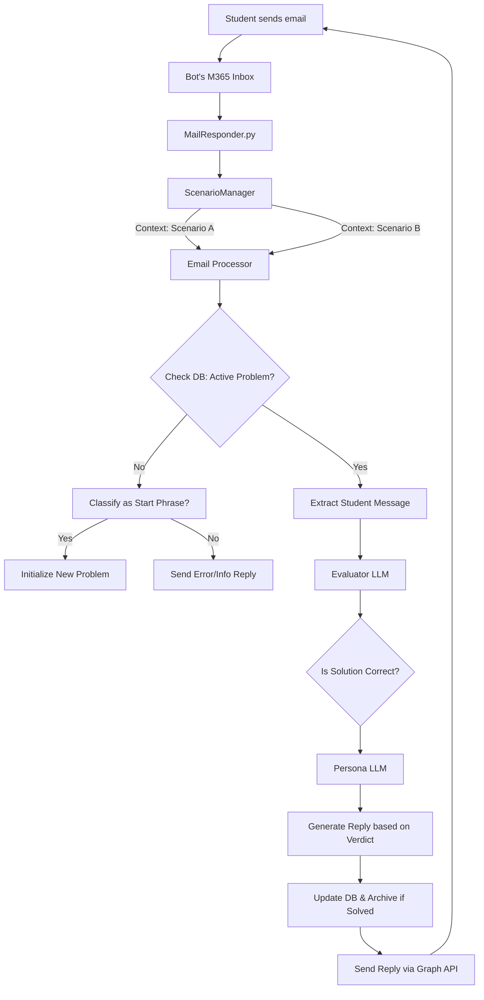

# MailResponder - Multi-Scenario AI Training Platform

MailResponder is an automated, AI-driven training platform designed to simulate realistic IT support and customer interaction conversations. It operates entirely over email, serving as a versatile environment for students to practice diagnostic, communication, and problem-solving skills across various scenarios.

The system is highly extensible, allowing for the creation of diverse "personas" and problem sets. Students progress through difficulty levels with automatic unlocks based on successful problem solving, while instructors can monitor progress via detailed analysis tools.

## Features

-   **Email-Based Interaction:** Communicates using the Microsoft Graph API to send and receive real emails.
-   **Multi-Scenario Architecture:** 
    - Supports multiple independent training scenarios simultaneously.
    - Each scenario has its own persona, problem set, and configuration.
    - **Custom Logic Hooks:** Scenarios can implement unique mechanics (like anger levels or timers) via a modular handler system.
    - Emails are dynamically routed to scenarios based on the target mailbox.
-   **Progressive Learning System:** Configurable difficulty levels (e.g., L1-L5) per scenario with automatic progression.
-   **Dynamic Persona Simulation:** Personas respond in character, localized to specific languages (e.g., Swedish) and communication patterns.
-   **Isolated Databases per Scenario:**
    - **Progress Tracking:** Tracks student progress and active conversations.
    - **Conversation Archiving:** Saves completed conversations to an archive.
    - **Debug Logging:** Full AI conversation histories and evaluator responses for analysis.
-   **Advanced Email Processing:**
    - Intelligent reply detection and conversation threading.
    - Email content cleaning and HTML parsing.
    - **Image Detection:** Automatically detects attachments and inline/copy-pasted images.
    - **Accessibility Warning:** Prepends configurable warnings to persona replies if images are detected.
-   **Dual-LLM Orchestration:**
    -   **Evaluator AI:** A logical model (e.g., gemma3) that determines if solutions correctly solve problems.
    -   **Persona AI:** A creative model that simulates the scenario's persona, aware of the evaluator's verdict and conversation context.
-   **Multi-User & Race Condition Prevention:** Handles multiple students simultaneously with robust concurrency management.
-   **Analysis Tools:** Comprehensive debugging via the `db_inspector.py` utility.

## How It Works

The system operates in a background loop, continuously checking one or more email inboxes defined in the active scenarios. When a message is received, the `ScenarioManager` routes it to the correct context, triggering the following lifecycle:



1.  **Scenario Discovery:** `ScenarioManager` loads all enabled scenarios from the `scenarios/` directory.
2.  **Email Polling:** `MailResponder.py` iterates through scenarios and fetches unread emails for each configured mailbox.
3.  **Contextual Processing:** `email_processor.py` filters noise and classifies the action (Start Problem vs. Continue Conversation).
4.  **Evaluation:** `evaluator.py` uses an LLM to judge the student's message against the problem's solution criteria.
5.  **Persona Generation:** `response_generator.py` creates a character-appropriate response based on the evaluation outcome.
6.  **Persistence:** Conversation history and progress are updated in the scenario-specific SQLite databases.

## Setup and Installation

### Prerequisites

-   Python 3.8+
-   An active [Ollama](https://ollama.com/) instance, running and accessible from where the script is hosted.
-   The LLM models specified in your `.env` file must be pulled in Ollama (e.g., `ollama pull gemma3:12b-it-qat`).
-   An Azure Active Directory (Azure AD) account with permissions to create and manage App Registrations.

### Step 1: Clone the Repository

```bash
git clone <your-repository-url>
cd <your-repository-directory>
```

### Step 2: Create and Activate Virtual Environment

It is critical to use a virtual environment to isolate project dependencies.

1.  **Create the environment:**
    ```bash
    python -m venv .venv
    ```

2.  **Activate the environment:**
    -   On **Windows** (PowerShell/CMD):
        ```bash
        .\.venv\Scripts\activate
        ```
    -   On **Linux / macOS**:
        ```bash
        source .venv/bin/activate
        ```
    Your command prompt should now be prefixed with `(.venv)`.

### Step 3: Install Python Dependencies

With the virtual environment active, install the required libraries from `requirements.txt`.

```bash
pip install -r requirements.txt
```

### Step 4: Azure App Registration

This bot requires access to a mailbox via the Microsoft Graph API. This is the most critical part of the setup.

1.  Go to the [Azure Portal](https://portal.azure.com/) and navigate to **Azure Active Directory** > **App registrations**.
2.  Click **New registration**.
3.  Give it a name (e.g., "UllaSupportBot").
4.  Under "Supported account types," select "Accounts in this organizational directory only."
5.  Click **Register**.
6.  **Save the following values** from the "Overview" page for your `.env` file:
    -   `Application (client) ID`
    -   `Directory (tenant) ID`
7.  Go to **Certificates & secrets** > **New client secret**.
8.  Add a description and set an expiry.
9.  **Immediately copy the `Value` of the new secret.** This is your only chance to see it.
10. Go to **API permissions** > **Add a permission**.
11. Select **Microsoft Graph**.
12. Select **Application permissions** (NOT Delegated permissions).
13. Add the following permissions:
    -   `Mail.ReadWrite`
    -   `Mail.Send`
14. Click **Add permissions**.
15. **Crucially**, grant admin consent by clicking the **Grant admin consent for [Your Tenant]** button and confirming. The status for the permissions must change to "Granted".

### Step 5: Configure Scenario Environment Variables

The system supports per-scenario configuration. For each scenario you wish to activate (e.g., `scenarios/example_scenario/`):

1.  Create a file named `.env` **inside the specific scenario directory**.
2.  Copy the following template and fill it out with credentials matching that scenario's target mailbox.

```dotenv
# --- Azure AD App Registration Credentials ---
AZURE_CLIENT_ID="<Your-Application-Client-ID-from-Azure>"
AZURE_TENANT_ID="<Your-Directory-Tenant-ID-from-Azure>"
AZURE_CLIENT_SECRET="<Your-Client-Secret-Value-from-Azure>"

# --- Target Mailbox (Scenario Specific) ---
BOT_EMAIL_ADDRESS="persona.name@yourdomain.com"

# --- LLM Model Configuration ---
PERSONA_MODEL="gemma3:12b-it-qat"
EVAL_MODEL="gemma3:12b-it-qat"
```

> [!NOTE]
> Values in the scenario's `.env` or `config.json` will override any global environment variables.

## Usage

### Running the Bot

Ensure your virtual environment is active (`(.venv)` is visible in your terminal).

#### Running in the Foreground
To run the bot and see live log output in your terminal, simply execute the script:
```bash
python MailResponder.py
```
This is recommended for testing and debugging. The script will stop if you close the terminal or press `Ctrl+C`.

#### Running in the Background (Linux/macOS)
For continuous operation on a Linux or macOS system, you can run the script as a background process using the `&` operator. This will free up your terminal for other commands.
```bash
python MailResponder.py &
```
**Note:** Be aware that if you close your terminal session, the background process may also be terminated. This method is suitable for short-term background execution where you plan to keep the session open.

### Utility Commands

-   **Database Inspector (`db_inspector.py`):**
    The primary tool for monitoring student progress and analyzing AI behavior across all scenarios.
    
    ```bash
    # Show summary of all scenarios and progress
    python db_inspector.py
    
    # Filter by specific student email
    python db_inspector.py -e student@example.com
    
    # Inspect full debug history (including raw AI thought blocks)
    python db_inspector.py --debug
    
    # Search for keywords in conversation histories
    python db_inspector.py --search "hårddisk"
    
    # List all loaded scenarios and their database paths
    python db_inspector.py --list
    ```

## Testing

MailResponder includes a comprehensive, isolated test suite that runs without requiring an internet connection or live LLM access (via extensive mocking).

### Running Tests
To run all unit tests and verification scripts, use the central test runner:

```bash
python tests/run_all.py
```

The suite covers:
- **Core Simulation**: Integration of email processing and LLM orchestration.
- **Scenario Logic**: Testing state tracking and fail states (e.g., Arga Alex).
- **Database**: Stability of student progress and history persistence.
- **Email Parsing**: Reliability of reply detection and HTML cleaning.
- **Verification**: Idempotency and prompt structure integrity.

## Project Structure

```
.
├── MailResponder.py          # Main application entry point (background loop)
├── scenario_handlers.py      # Extension: Modular hooks for scenario-specific logic
├── scenario_manager.py       # Core: Manages discovery and loading of scenarios
├── email_processor.py        # Orchestration: Routes emails to the correct scenario context
├── conversation_manager.py   # Logic: Manages conversation flow and state transitions
├── response_generator.py     # AI: Generates persona-specific replies
├── evaluator.py              # AI: Logic for judging student solutions
├── email_parser.py           # Utility: Extracts clean text (persona-agnostic)
├── database.py               # Data: SQLite operations and schema management
├── db_inspector.py           # Tools: CLI for monitoring progress
├── graph_api.py              # API: Microsoft Graph integration
├── config.py                 # Config: Central environment management
├── llm_client.py             # Client: Ollama API integration wrapper
├── scenarios/                # Directory containing specific training scenarios
│   └── example_scenario/     # A self-contained scenario folder
│       ├── config.json       # Scenario metadata, email, and model selection
│       ├── problems.json     # Catalog of problems, start phrases, and solution keys
│       ├── persona_prompt.txt # System prompt defining the persona's character
│       ├── evaluator_prompt.txt # System prompt defining evaluation rules
│       ├── .env              # Scenario-specific secrets (M365 credentials, etc.)
│       └── [prefix]_conversations.db # Auto-generated databases for this scenario
├── tests/                    # Comprehensive test suite and verification scripts
│   └── run_all.py            # Central test runner
├── requirements.txt          # Python dependencies
└── example.env               # Global environment configuration template (root)
```

## Configuration and Extension

The system is designed to be extended by adding new scenario folders to the `scenarios/` directory. Each folder is a self-contained training module.

### 1. Create Scenario Configuration (`config.json`)
Define the scenario's behavior, target mailbox, and specific LLM models:
```json
{
  "scenario_name": "Technical Support",
  "persona_name": "Kim",
  "db_prefix": "tech_support",
  "target_email": "kim.support@domain.com",
  "persona_model": "gemma3:12b",
  "eval_model": "gemma3:12b",
  "image_warning_message": "Kim confirms they cannot see images."
}
```

### 2. Define Problems (`problems.json`)
Structure your training into levels. Each level is unlocked when a problem from the previous level is solved:
- **`start_phrases`**: An array of phrases that students email to start a specific level.
- **`catalog`**: An array of levels, each containing a list of potential problems.

### 3. Author Prompts
- **`persona_prompt.txt`**: Define the character, tone, and communication style.
- **`evaluator_prompt.txt`**: Define the criteria for a "solved" problem. The evaluator should output `[LÖST]` when the student provides the correct solution.

### 4. Advanced: Custom Logic (Handlers)
For scenarios requiring complex state tracking (like "Arga Alex"), you can implement a custom handler in `scenario_handlers.py`. The system calls these hooks at specific points:
- `on_start_problem`: Initialize scenario-specific state (e.g., set anger to 100).
- `is_problem_solved`: Override the solver verdict based on state (e.g., reject if anger > 10).
- `check_failure_state`: Terminate the session if failure conditions are met (e.g., anger reaches 200).
- `modify_persona_context`: Inject state information into the AI's prompt.
